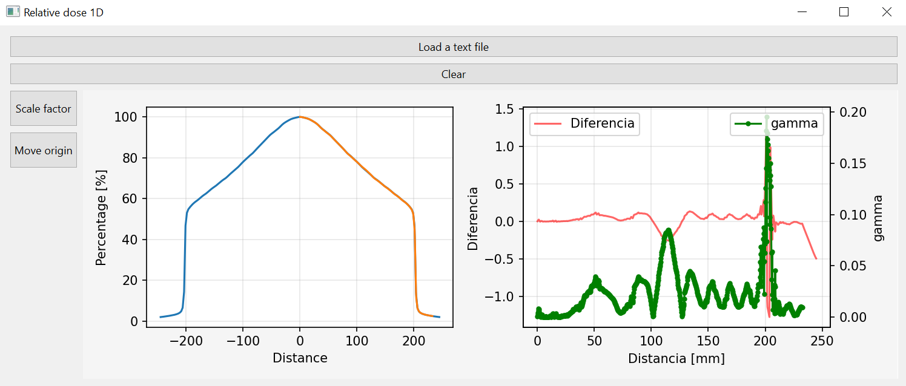

# relative_dose_1d

Python package to read 1-dimensional dose profile from a text file and perform subtraction and gamma index comparison.



## Format specifications
Data should be in M ​​rows by 2 columns, corresponding to positions and
dose values, respectively.

The package has been tested with the following examples:

* File in w2CAD format (used by the TPS Eclipse 16.1, Varian(R) company).

    In the algorithm, the start of the data is identified by the words: 'STOM' or 'STOD'
    Physical unit assumed to be in mm.

* File in mcc format (Verisoft 7.1.0.199 software, from PTW(R) company).

    In the algorithm, the beginning of the data is identified by the word: 'BEGIN_DATA'
    Physical unit assumed to be in mm.

* File in txt format.
    The data must be distributed in M ​​rows by 2 columns and separated
    for a blank space. The script ask for a word to identify the beginning of the data in the text file, 
    a number to add to the positions, and a factor for distance dimension conversion.

```{tableofcontents}
```
